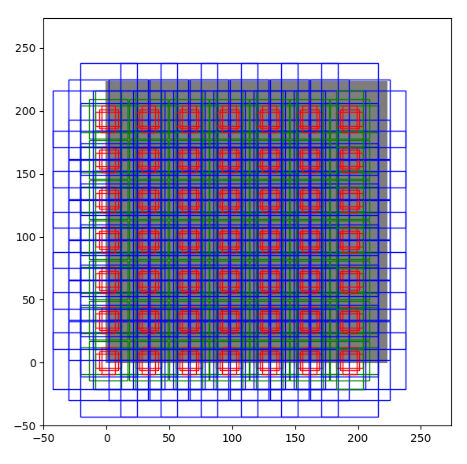

# Faster RCNN
这篇文章介绍一下非常流行的检测模型Faster-RCNN。因为已经有很多相关博客了，所以这篇博客主要从实现的细节方面，并且结合mmdetection的代码来解读这篇论文。

首先回顾一下Fast-RCNN的一个问题：候选框(proposal)的提取仍然需要传统方法，比如selective search，耗费时间较长（通常要1~2s）。由于后续的检测纯粹是网络的前传操作，可以很快完成，**候选框的提取时间成为了整个检测框架运行时间的瓶颈**。

Faster-RCNN在Fast-RCNN的基础上，**提出了Region Proposal Network(RPN)，将原来用于检测的网络同时用于候选框的提取，从而把整个检测框架的时间降了下来，因而达到了实时检测的时间性能。**整个Faster-RCNN的架构如下图所示


这篇文章主要讲解RPN的实现过程（上图左下角这一块），解答如下几个问题：
1. 什么是anchor？
2. anchor是如何分配标签的？
3. RPN是如何训练的？
4. RPN是如何生成候选框的？

## Anchor
**anchor可以理解为一个位置预定义的固定矩形框。为了尽可能检测到所有的物体，就可以通过设计多种不同类型（宽高比例、面积大小）的anchor，来尽可能的覆盖所有可能的窗口**。假设骨干网络的输出特征维度为$d\times h\times w$（论文里配置而言，h,w一般为40*60）。每个输出位置都有3种不同宽高比(0.5,1.0,2.)和3种不同面积大小(16\*16,32\*32,64\*64，为画图方便，跟论文的不太一样)，也就是说一个输出位置会对应3\*3=9个anchor，如图就是一个输出位置对应的anchor，灰色区域是图片，相同颜色的anchor具有相同的面积：


现在对于$h\times w$大小的特征图谱，总共会有$h\times w\times 9$多个anchor，大约有40\*60\*9=21600个anchor。把它们全部画出来，就是下面这个样子：

这样，基本上物体所有可能出现的位置都会有anchor覆盖到。

在实现的时候，mmdetection是如何生成所有anchor的$(x_a, y_a, w_a, h_a)$坐标的呢？
1. 首先生成一个位置(通常是图片左上角)的所有anchor（称为base anchors）；
2. 然后对每个位置计算一个偏移量。一般而言，对位置`(i,j)`，偏移量=`(i*stride, j*stride)`，这里的stride控制了anchor的密度。
3. base anchor加上这个偏移量就可以得到所有位置的anchors了。

> 具体实现用到了大量的广播操作，感兴趣的可以看源码了解一下。

```python
class AnchorGenerator(object):

    def __init__(self, base_size, scales, ratios, scale_major=True, ctr=None):
        """
        :param base_size: int,
        :param scales: tuple, the actual area of the anchor is:
              (base_size * scale)^2
        :param ratios: tuple, the ratio of height to width (h/w)
        :param ctr: tuple, center of the anchor in the image. None
        means (base_size/2, base_size/2).
        """
        self.base_size = base_size
        self.scales = torch.Tensor(scales)
        self.ratios = torch.Tensor(ratios)
        self.scale_major = scale_major
        self.ctr = ctr
        self.base_anchors = self.gen_base_anchors()

    def gen_base_anchors(self):
        w = self.base_size
        h = self.base_size
        if self.ctr is None:
            x_ctr = 0.5 * (w - 1)
            y_ctr = 0.5 * (h - 1)
        else:
            x_ctr, y_ctr = self.ctr

        h_ratios = torch.sqrt(self.ratios)
        w_ratios = 1 / h_ratios
        if self.scale_major:
            ws = (w * w_ratios[:, None] * self.scales[None, :]).view(-1)
            hs = (h * h_ratios[:, None] * self.scales[None, :]).view(-1)
        else:
            ws = (w * self.scales[:, None] * w_ratios[None, :]).view(-1)
            hs = (h * self.scales[:, None] * h_ratios[None, :]).view(-1)

        base_anchors = torch.stack(
            [
                x_ctr - 0.5 * (ws - 1), y_ctr - 0.5 * (hs - 1),
                x_ctr + 0.5 * (ws - 1), y_ctr + 0.5 * (hs - 1)
            ],
            dim=-1).round()

        return base_anchors

    def _meshgrid(self, x, y, row_major=True):
        xx = x.repeat(len(y))
        yy = y.view(-1, 1).repeat(1, len(x)).view(-1)
        if row_major:
            return xx, yy
        else:
            return yy, xx

    def grid_anchors(self, featmap_size, stride=16, device='cuda'):
        base_anchors = self.base_anchors.to(device)

        feat_h, feat_w = featmap_size
        shift_x = torch.arange(0, feat_w, device=device) * stride
        shift_y = torch.arange(0, feat_h, device=device) * stride
        shift_xx, shift_yy = self._meshgrid(shift_x, shift_y)
        shifts = torch.stack([shift_xx, shift_yy, shift_xx, shift_yy], dim=-1)
        shifts = shifts.type_as(base_anchors)
        # first feat_w elements correspond to the first row of shifts
        # add A anchors (1, A, 4) to K shifts (K, 1, 4) to get
        # shifted anchors (K, A, 4), reshape to (K*A, 4)

        all_anchors = base_anchors[None, :, :] + shifts[:, None, :]
        all_anchors = all_anchors.view(-1, 4)
        # first A rows correspond to A anchors of (0, 0) in feature map,
        # then (0, 1), (0, 2), ...
        return all_anchors
```

## 给Anchor分配标签
这一章节区分一下RPN网络涉及到的3种坐标，分别是：
- **anchor box**：anchor的预定义坐标，记为$(x_a, y_a, w_a, h_a)$
- **gt box**：人工标注的Ground truth box，记为$(x_t, y_t, w_t, h_t)$
- **prediction box**：网络输出的预测坐标，记为$(x_p, y_p, w_p, h_p)$

上一章节解释了什么是anchor，以及如何生成anchor的预定义坐标，但训练的时候我们还要知道一个anchor是positive的（存在目标）还是negative的（不存在目标），如果是positive的，它对应的gt box是哪个？

比如现在已经知道图片里有两个物体，标注如下为：gt1 = (10, 10, 100, 100, 猫), gt2 = (40, 40, 200, 200, 狗)。为了分配标签，我们需要知道一个anchor box跟gt box的重叠程度，可以通过Box IoU指标确定。针对一张图片，mmdetection里的分配标签分4步走：
1. 先全置为-1；
2. 对每一个anchor box，如果所有gt box跟它的iou值都小于0.3，那么认为是negative，置为0；
3. 对每一个anchor box，如果存在gt box跟它的iou值大于0.7，那么认为是positive，并且把iou值最大的那个gt的坐标分配给这个anchor；
4. 对每一个gt box，把它分配给跟它iou值最大的anchor box，前提是跟这个anchor box的iou值大于0.3。

> 也是就说，标签分配会产生3中类型的anchor，分别是-1, 0, 1，**在训练的时候只从标签为0和1的anchor里采样。**

## RPN的训练过程
RPN的训练损失包含两部分，分类损失和回归损失。其中，每个anchor都会有**分类损失**，就是简单的二分类，用交叉熵损失即可。另外，对于positive的anchor，还要对anchor box进行矫正，所以会有一个**回归损失**，一般用huber loss（也叫SmoothL1Loss）。

下面简单介绍一下回归损失。首先一点非常重要：**RPN不是直接生成坐标预测$(x_p, y_p, w_p, h_p)$，而是生成一个矫正值**
$$
O_x = \frac{x_p-x_a}{w_a} \\
O_y = \frac{y_p-y_a}{h_a} \\
O_w = \frac{w_p}{w_a} \\
O_h = \frac{h_p}{w_p}
$$
上面公式中，$O_x, O_y, O_w, O_h$就是RPN网络的真正输出。所以回归损失为：
$$
L_{reg} = L(O_x, \log\frac{x_t - x_a}{w_a}) + L(O_y, \log\frac{y_t - y_a}{h_a}) + L(O_w, \log\frac{w_t}{w_a}) + L(O_h, \log\frac{h_t}{h_a})
$$
其中$L$即为SmoothL1Loss。

训练的时候，从0和1的anchor采样256个进行训练，一般会限制一下正负样本的比例。

## 利用RPN生成候选框
当RPN训练好以后，我们可以提取候选框给后续的检测流程，具体步骤如下：
1. 首先根据每个anchor的分数（概率）按从大到小排序，取top k（比如训练的时候top 2000， 测试只取top 1000）；
2. 前面已经知道RPN只生成矫正量$(O_x, O_y, O_w, O_h)$，我们需要用这个矫正量还还原回真正的预测坐标$(x_p, y_p, w_p, h_p)$，如此得到top k个proposal；
3. 最后对这top k个proposal进行NMS后处理，得到最终的proposal。

## 总结
这篇文章解释了Faster-RCNN里的RPN网络涉及的相关问题，包括anchor的生成，标签分配，训练再到最终的候选框提取。了解了这些再去看一下mmdetection里有关RPN的配置就很容易看懂，每个参数的具体含义。