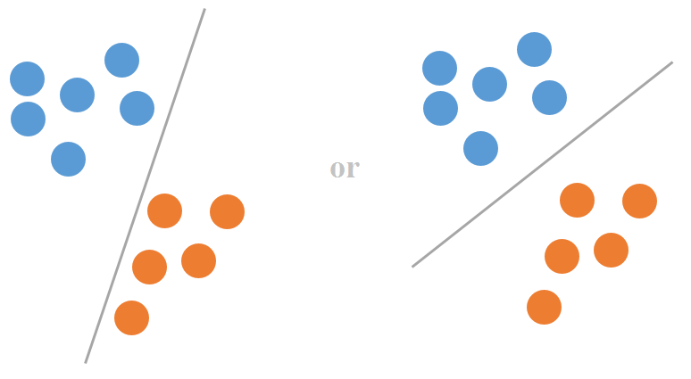
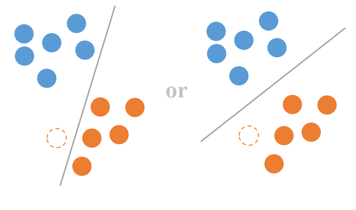

# 支持向量机

其实自己已经多次阅读相关支持向量机(Support Vector Machine)算法的不少材料了，但都没有花点时间去总结归纳一下，所以这篇博客就支持向量机涉及到的一些知识点归纳一遍。首先介绍一下从直觉上解释一下为什么要提出“最大间隔分类器”这么个概念，接着形式化定义SVM涉及的优化问题，然后探讨如何利用拉格朗日对偶进行优化问题的等价转换，继而探讨如何在转换后的优化问题上进行求解算法。

最大间隔 --\> 引出SVM的原始优化问题(Primal Problem) --\> 转换后的对偶问题(Dual Problem) --\> 解决对偶问题的SMO算法

## 最大间隔分类器
考虑训练集线性可分的情形：即一定存在一个决策平面使得正样本在一侧，而负样本在另一侧。下图给出了可能的两个决策平面，那么怎么样的决策边界是我们期望的呢？

根据样本的相似性（距离而言），在训练集之外，左下角位置很可能存在一个橙色样本（虚线）。如果根据左边的决策边界，那么这个模型未见过的橙色样本就会被错分为蓝色样本；而如果根据右边的决策边界，我们还是可以正确预测该样本为橙色。

由此可见，**右边的决策边界对未知数据的泛化性能更优，模型也更加的鲁棒**。这个决策边界直观上有这样的特性：**它距离两边的正负样本都尽可能远，由它定义的分类器也称为最大间隔分类器**。后面我们再探讨数学形式的严格定义。

## SVM的原优化问题

上一章节我们从直观上描述了最大间隔分类器的特性，这一章节我们引入严格的数学定义，从而得到SVM的原优化问题。

假设我们的训练数据集为$\{(x_1, y_1), ..., (x_m, y_m)\}$有$m$个样本，每个样本的特征维度为$n$，即$x_i\in R^n$。另外，每个训练样本的数据标注的取值为-1或+1，即$y_i\in \{-1, +1\}$。

假设我们已经有一条决策边界$P$，并且它到最近的正负样本距离都是相等的（刚好在中间），它由下面的方程表示：
$$
w^Tx+b = 0
$$
那么我们可以通过引入一个额外的参数$k\gt 0$，来表示跟$P$平行且跟最近的样本相交的直线$P_{-1}$和$P_{+1}$：
$$
\begin{split}
P_{-1}:w^Tx+b&=k \\
P_{+1}:w^Tx+b&=-k
\end{split}
$$

那么决策边界$P$的间隔就可以表示为两条平行直线$P_{-1}$和$P_{+1}$的距离：
$$
d = \frac{k - (-k)}{||w||_2} = \frac{2k}{\sqrt{w^Tw}}
$$
为了后续优化方便，我们对距离取平方以去掉根号：
$$
d^2  = \frac{4k^2}{w^Tw}
$$
这里$k$不是毫无限制的，$k$的取值要保证，所有的负样本在$P_{-1}$和$P$的同一侧，而所有的正样本要在$P_{+1}$和$P$的同一侧，也就是
$$
\begin{split}
w^Tx_i+b&\le -k, y_i=-1\\
w^Tx_i+b&\ge k, y_i=+1
\end{split}
$$
上面两个不等式约束可以统一为：
$$
y_i(w^Tx_i+b)\ge k
$$
于是可以得到我们第一个优化问题
$$
\begin{split}
\max_{w,b,k} \frac{4k^2}{w^Tw}\\
st. y_i(w^Tx_i + b)\ge k \\
k \gt 0
\end{split}
$$
通过简单的变换可以发现$k$其实是一个多余的参数：
$$
\begin{split}
\max_{w,b,k} \frac{4}{(\frac{w}{k})^T(\frac{w}{k})}\\
st. y_i((\frac{w}{k})^Tx_i + (\frac{b}{k}))\ge 1 \\
k \gt 0
\end{split}
$$
利用$w'=\frac{w}{k}, b'=\frac{b}{k}$进行换元，我们可以去掉关于$k$的依赖，从而得到新的优化问题
$$
\begin{split}
\max_{w',b'} \frac{4}{w'^Tw'}\\
st. y_i(w'^Tx_i + b')\ge 1 \\
\end{split}
$$
容易知道，由参数$w', b'$和$w,b$确定的决策边界是一样的。为了表示的方便，我们还是用回原来的参数字母$w,b$，重写上面的优化问题：
$$
\begin{split}
\max_{w,b} \frac{4}{w^Tw}\\
st. y_i(w^Tx_i + b)\ge 1
\end{split}
$$
注意这里的$w, b$含义已经改变了，但是定义的决策边界是一样的，如此我们去除了关于变量$k$的依赖。为了便于求导和后续的讨论，我们倒过来把最大化问题转化为最小化问题（并且拿掉了一个因子2）：
$$
\begin{equation}
\begin{split}
\min_{w,b} \frac{1}{2}w^Tw\\
st. y_i(w^Tx_i + b)\ge 1
\end{split}
\end{equation}
$$
这就是由最大间隔引出的SVM原始优化问题。

很明显这个问题是二次的凸优化问题，可以由一些方法求得解，但时间开销比较大。下一章节我们将讨论如何利用拉格朗日对偶把上述的关于$w,b$的原始优化问题，转换为关于拉格朗日乘子$\alpha$的对偶问题。

## 拉格朗日对偶

