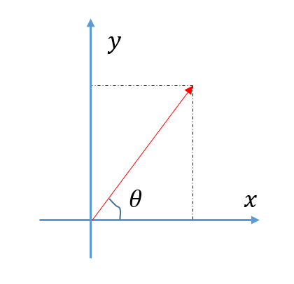
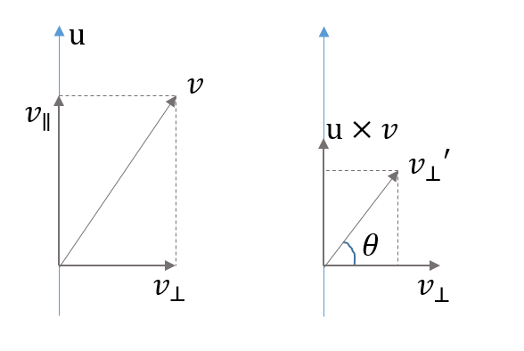

# Rodrigues Transformation

最近在学习人体姿态相关的知识，会涉及到一些3d坐标的处理，比如旋转操作是可以由**罗德里格变换公式**得到。这篇博客简单推导一下这个公式，另外还给出一个等价的变形表达式。

## 2d平面上的旋转

假设我们有一个向量在x轴上，那么旋转$\theta$得到的结果就是
$$
v' = ||v||\begin{bmatrix}
\cos\theta\\
\sin\theta\\
\end{bmatrix}
$$
更一般的，我们希望对任意的2d向量$v=[x, y]^T$进行旋转$\theta$。借鉴上面的推导，我们以当前向量$v$作为x轴，而$u=[y, -x]$作为y轴，那么很容易验证$u^Tv = 0$.那么很容易得到
$$
v'=v\cos\theta+u\sin\theta
$$
写成矩阵的形式就是
$$
v'=\begin{bmatrix}
\cos\theta & \sin\theta\\
-\sin\theta & \cos\theta
\end{bmatrix}
\begin{bmatrix}
x\\
y
\end{bmatrix}
$$

## 3d平面上的旋转

在3d平面上讨论旋转（如下图左），一般会采用轴角(axis-angle)的方式来表示旋转，即指定一个旋转轴$u$以及逆时针旋转的角度$\theta$。有了这两个变量，我们就可以表示3d平面里的任意旋转了。

接下来我们都讨论**旋转轴$u$都是单位向量的情形**，并且是在右手坐标系下讨论。

可以把$v$分成两部分，垂直旋转轴的$v_\perp$和平行于旋转轴的$v_\parallel$（如上图左）：
$$
\begin{align}
v_\parallel&=(u\cdot v)u\\
v_\perp&=v-(u\cdot v)u
\end{align}
$$
**旋转不改变平行的分量，所以我们只需要旋转垂直那部分分量即可**。如果我们从$u$上面往下看，只要能找到与$v_\perp$垂直的另外一个向量，就可以在垂直于$u$的平面上对$v_\perp$进行类似2d平面上的旋转（如上图右）。

而根据向量外积(cross product)的定义，$u\times v_\perp$刚好满足我们的要求（根据右手法则，伸出右手掌，食指指向$u$，而$v_\perp$从手掌中穿出，那么大拇指对应的方向就是向量外积$u\times v_\perp$对应的方向）。容易验证，$u\times v_\perp$的长度跟$v_\perp$一致，那么根据2d的旋转结论：
$$
v_\perp'=v_\perp\cos\theta + (u\times v_\perp)\sin\theta
$$
加上原来不变的平行分量
$$
v'=v'_\parallel+v'_\perp
$$
简单地化简一下，就有：
$$
v'=v\cos\theta+(1-\cos\theta)(v\cdot u)u+\sin\theta(u\times v)
$$
我们一般写成矩阵相乘的形式，取$u=[x, y, z]^T$，那么$v$右乘$u$相当于乘以下面的矩阵：
$$
U=\begin{bmatrix}
0 & -z & y\\
z & 0 & -x \\
-y & x & 0
\end{bmatrix}
$$
于是，用矩阵的形式可以表示上面的旋转变换：
$$
\begin{align}
v' & = Rv\\
R &= I\cos\theta + (1-\cos\theta)uu^T+U\sin\theta
\end{align}
$$
也就是所谓的罗德里格旋转公式。

## Bonus

非常有意思的是，有些文章（比如SMPL）用了另外一种等价的表达方式，$R$完全用$U$去计算，即：
$$
R=I+U^2\cos\theta + U\sin\theta
$$
这也就是说$I\cos\theta + (1-\cos\theta)uu^T = I+U^2\cos\theta$。

简单地算一下：
$$
\begin{split}
I+U^2\cos\theta & =\begin{bmatrix}
1 & 0 & 0\\
0 & 1 & 0\\
0 & 0 & 1\\
\end{bmatrix}
+
\cos\theta\begin{bmatrix}
-z^2-y^2 & xy & xz \\
yx & -z^2-x^2 & yz \\
zx & zy & -x^2-y^2\\
\end{bmatrix}\\

I\cos\theta + (1 - \cos\theta)uu^T &=\cos\theta\begin{bmatrix}
1 & 0 & 0\\
0 & 1 & 0\\
0 & 0 & 1\\
\end{bmatrix}
+
(1-\cos\theta)\begin{bmatrix}
x^2 & xy & xz \\
yx & y^2 & yz \\
zx & zy & z^2\\
\end{bmatrix}\\
&=I\cos\theta + (1-\cos\theta)(I+U^2)\\
&= I+U^2\cos\theta
\\
\end{split}
$$

> 上面的推导利用了$u$是单位向量的性质，即$x^2+y^2+z^2=1$。

